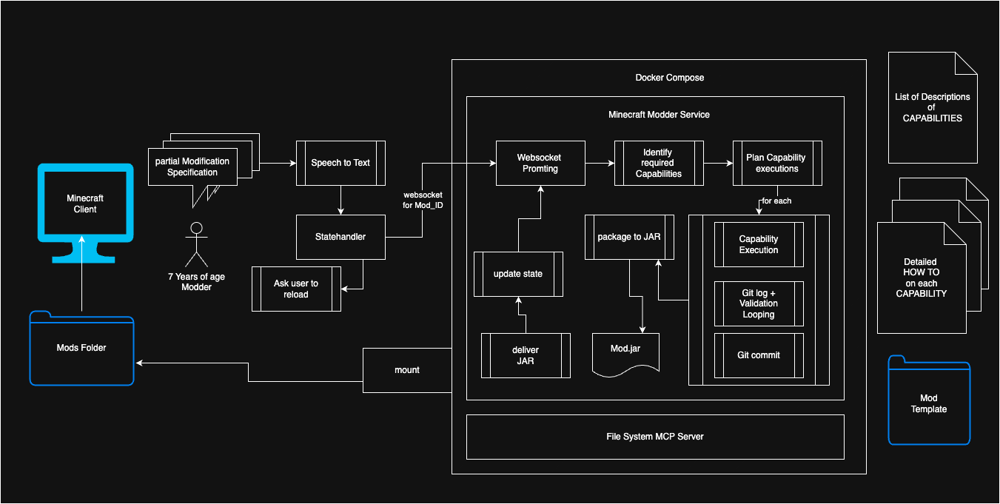

# Minecraft Mod Generation Service
A Service to generate Mods on natural language specifications. 
The user can verbally describe what they want to add/modify in the game of Minecraft. 
The argentic System will generate the required resources, pack them to a jar and deliver it to the mods folder of the User. The user can reload or open a create world, where this mod is enabled, and inspect the changes. 

_High-level flow: user request → agent → mod resources → packaged mod (jar)_

## Local Setup
As this project is in an early stage, only a local VSCode setup is available, used by myself. There is a [lauch setting](.vscode/launch.json) for VSCode, and a devcontainer setup. Open the project in the devcontainer setup, there you can run the debugging entry point using VSCode. 
 The debug entry point is defined here [debug.py](modder_mc_service/debug.py)
This setup expects some folders to be present. Check the [devcontainer setup](.devcontainer/docker-compose.workspace.yml) for code (better than words). Most importantly we are mounting
- ../mods:/mods
- ../assets:/assets
- the minecraft mods folder of your minecraft installation (I am on Mac)

In the /mods folder we need a template for new mods. Use [this template repo](https://github.com/schlesingerphilipp/template-forge-1.21.3-53.1.4) with `git clone git@github.com:schlesingerphilipp/template-forge-1.21.3-53.1.4.git` and move it to `mods/template`

In the assets folder add images and soundfiles with a filename that would be fitting for your request. 

Compiling and delivery are not jet part of the agent, but simple. Use these two commands:
`cd /mods/YOUR_MOD_NAME && ./gradlew jar` for building
and once the program compiled, use `cd /mods/YOUR_MOD_NAME && make dev-deploy` to move it into the mod folder of the Minecraft installation.

The mod name is not jet replaced in the build properties, so all mods are named example-mod. 

## Current WIP
I created example Mods, to learn how to make certain changes, and documented these changes in step by step guides. There are currently two capabilities: 
- Adding a Block with texture
- Adding sound interactions to a block (breaking, steppping on it)

These are few but sufficient capabilities to develope an initial version, where I can implement the agent behavior and the required tools, as well as the interface

Step by step I will add more capabilities, error handling, validation and generative capabilities for new images and new sounds. Another point are SLMs, as many task are super simple. Local SLMs should be able do it. 

## Exploration Hypothesis
The approach of this service is to provide detailed HowTos on singular capabilities, like e.g. adding a sound effect to a block. These capabilities are the tools for the agent, and the agent can choose which tools to use for a given task.
I am exploring the approach of minimal liberty of LLMs. For Minecraft Mods there is alot of uncertainty with changes across versions. So there is no publicly available Knowledge Base, that would allow an independent black box approach. Changes across Versions render existing tutorials worthless. A specific version requires careful craftsmanship. Still this craftsmanship is not neccessarily deterministic, so that only templating engines with carefully crafted templates would be the only solution. There is space for natural language understanding in the space of exploration. The hypothesis of this approach is that the sum is more than its elements. Specific instructions can be combined. 
Further LLMs ease the process of injection. New files are well covered by templates, while injecting snippets is not easily done with templates. Like that the approach promises an avenue towards a capable service, even if it is not magically covering everything, it allows to easily add new How Tos aka Capabilities. 

