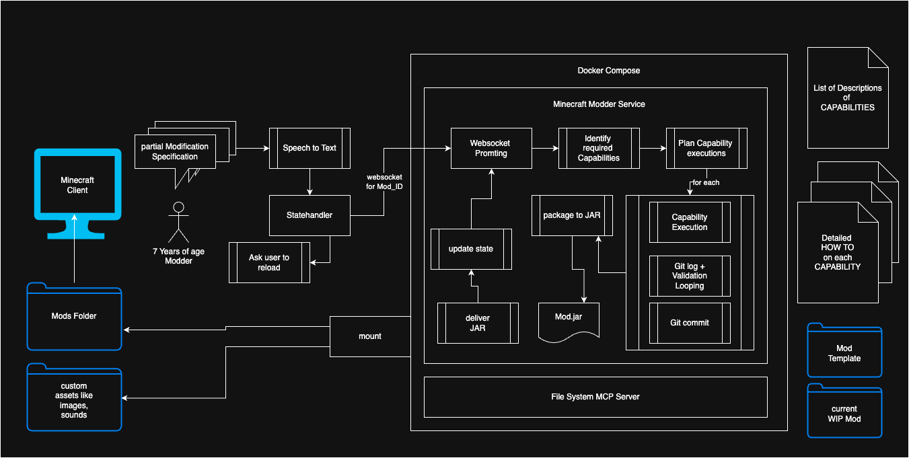

# Minecraft Mod Generation Service
A Service to generate Mods on natural language specifications. 
The user can verbally describe what they want to add/modify in the game of Minecraft. 
The argentic System will generate the required resources, pack them to a jar and deliver it to the mods folder of the User. The user can reload or open a create world, where this mod is enabled, and inspect the changes. 

_High-level flow: user request → agent → mod resources → packaged mod (jar)_

## Current WIP
I created example Mods, to learn how to make certain changes, and documented these changes in step by step guides. There are currently two capabilities: 
- Adding a Block with texture
- Adding sound interactions to a block (breaking, steppping on it)

These are few but sufficient capabilities to develope an initial version, where I can implement the agent behavior and the required tools, as well as the interface